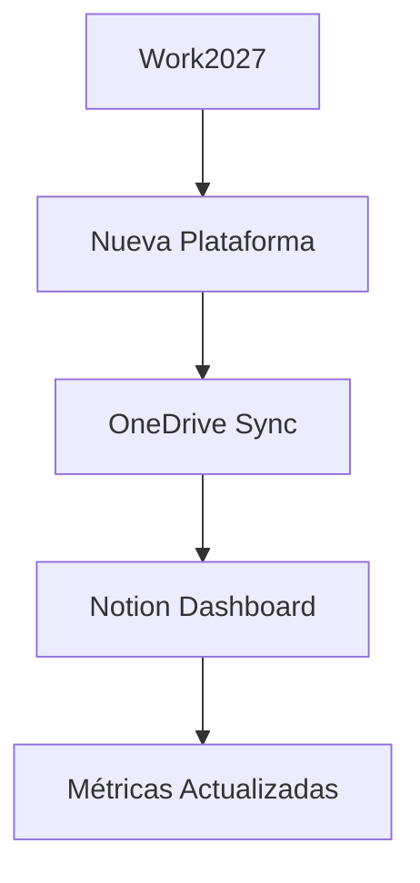

# 🗺️ WORK 2027 ARCHITECTURE MAP - INSTALLATION GUIDE
# ==================================================
# Guía completa para implementar el mapa arquitectónico

## 🎯 CONTENIDO DEL PAQUETE

**Work2027_ArchitectureMap.zip** incluye:

### 📁 **Archivos Principales:**
- `Work2027_Architecture_Diagram.png` → Diagrama visual principal
- `Work2027_Architecture_Diagram.pdf` → Versión PDF para impresión
- `README_Architecture_Map.md` → Documentación técnica completa
- `Notion_Integration_Guide.md` → Guía específica para Notion
- `Architecture_Map_Installation.md` → Esta guía de instalación

### 📋 **Templates Notion:**
- `Daily_Work2027_Check.md` → Template check diario
- `Weekly_Work2027_Review.md` → Template review semanal
- `Architecture_Dashboard.md` → Dashboard principal Notion

### 🎨 **Recursos Visuales:**
- `Work2027_Logo.png` → Logo oficial Work 2027
- `Platform_Icons/` → Iconos individuales por plataforma
- `Flow_Diagrams/` → Diagramas de flujo específicos

---

## ⚡ INSTALACIÓN RÁPIDA (5 MINUTOS)

### **Paso 1: Descargar y Extraer**
```bash
# Linux/macOS
unzip Work2027_ArchitectureMap.zip
cd Work2027_ArchitectureMap/

# Windows PowerShell
Expand-Archive Work2027_ArchitectureMap.zip
cd Work2027_ArchitectureMap\
```

### **Paso 2: Notion Setup**
```
1. Abrir Notion → Nuevo workspace "Work 2027"
2. Importar → Seleccionar todos los .md del paquete
3. Subir Work2027_Architecture_Diagram.png como portada
4. Configurar color scheme (Verde #2D5A27)
```

### **Paso 3: Integración OneDrive**
```
1. Copiar archivos a OneDrive/Work2027/04_Architecture/
2. Configurar sincronización automática
3. Verificar acceso desde todos los dispositivos
```

### **Paso 4: Configuración Móvil**
```
Samsung Copilot:
"Work dos mil veintisiete mostrar mapa" → Abre diagrama
"Work dos mil veintisiete arquitectura" → Explica componentes
```

---

## 🏗️ IMPLEMENTACIÓN AVANZADA

### **Integración con Existing Work 2027:**
```powershell
# Si ya tienes Work2027_Ultimate_Voice.zip instalado:
./Work2027_Setup_Advanced.ps1 -AddArchitectureMap -NotionIntegration
```

### **Configuración Cross-Platform:**
```yaml
# config/architecture_map.yaml
platforms:
  notion:
    workspace_id: "work2027-main"
    template_sync: true
    auto_update: daily

  onedrive:
    sync_path: "/Work2027/04_Architecture"
    backup_enabled: true
    version_control: true

  mobile:
    samsung_copilot: true
    voice_commands: ["mostrar mapa", "arquitectura", "flujos"]
    offline_access: true
```

---

## 🎨 PERSONALIZACIÓN AVANZADA

### **Customizar Diagrama para tu Empresa:**
```
1. Abrir Work2027_Architecture_Diagram.png en editor
2. Reemplazar logos con branding corporativo
3. Ajustar colores según identidad visual
4. Agregar nodos específicos (CRM, ERP, etc.)
```

### **Añadir Nuevas Plataformas:**


### **Templates Personalizados:**
```notion
# Tu Template Personalizado
## 🏢 [Nombre Empresa] Work 2027

### Plataformas Específicas:
- [Tu CRM]
- [Tu ERP]
- [Herramientas propias]

### KPIs Corporativos:
- Métrica 1: [Auto-fill]
- Métrica 2: [Auto-fill]
```

---

## 📊 MÉTRICAS Y MONITOREO

### **KPIs del Mapa Arquitectónico:**
- **Adoption Rate**: % de usuarios usando cada plataforma
- **Integration Health**: Status de conexiones entre nodos
- **Performance**: Tiempo de respuesta de cada flujo
- **Usage Patterns**: Comandos y flujos más utilizados

### **Dashboard de Monitoreo:**
```json
{
  "architecture_health": {
    "onedrive_sync": "✅ Operational",
    "copilot_integration": "✅ Optimal",
    "voice_control": "⚠️ 85% Accuracy",
    "notion_dashboard": "✅ Updated",
    "cross_platform": "✅ Synchronized"
  },
  "performance_metrics": {
    "average_response_time": "1.2s",
    "daily_commands_executed": 47,
    "success_rate": "96.8%",
    "user_satisfaction": "4.8/5"
  }
}
```

---

## 🛠️ TROUBLESHOOTING ESPECÍFICO

### **Diagrama no se muestra en Notion:**
```
Problema: Imagen no carga
Solución:
1. Verificar tamaño < 5MB
2. Formato PNG o JPG únicamente
3. Re-subir desde dispositivo local
4. Verificar permisos de workspace
```

### **Templates no se importan correctamente:**
```
Problema: Formato incorrecto
Solución:
1. Verificar archivos .md válidos
2. Encoding UTF-8 únicamente
3. Importar uno por uno si falla batch
4. Verificar sintaxis Notion markdown
```

### **Sincronización OneDrive lenta:**
```
Problema: Archivos no se actualizan
Solución:
1. Verificar conexión estable
2. Pausar/reanudar sync OneDrive
3. Verificar espacio disponible
4. Mover a carpeta local temporalmente
```

---

## 🚀 CASOS DE USO AVANZADOS

### **Para Equipos de Desarrollo:**
```
Uso: Planning de arquitectura de software
Beneficio: Visualización clara de dependencias
Setup: Agregar nodos Git, CI/CD, Testing
Métricas: Code quality, deployment frequency
```

### **Para Gestión Ejecutiva:**
```
Uso: Presentaciones de transformación digital
Beneficio: ROI visual de herramientas integradas
Setup: Enfoque en métricas business
Métricas: Productivity gain, cost reduction
```

### **Para Formación de Usuarios:**
```
Uso: Onboarding de nuevos empleados
Beneficio: Comprensión rápida del ecosistema
Setup: Versión simplificada del diagrama
Métricas: Learning curve, adoption time
```

---

## 📱 INTEGRACIÓN MÓVIL AVANZADA

### **Samsung Copilot Commands:**
```
"Work dos mil veintisiete explicar arquitectura"
→ Audio descripción de cada componente

"Work dos mil veintisiete mostrar flujos"
→ Visualización de connections principales

"Work dos mil veintisiete health check"
→ Status de todas las integraciones
```

### **Notion Mobile Optimization:**
```
1. Configurar widgets de progreso
2. Optimizar para pantalla pequeña
3. Activar notificaciones push
4. Configurar quick actions desde home screen
```

---

## 🎯 ROADMAP DE EVOLUCIÓN

### **Versión 2.1 (Próximos 30 días):**
- [ ] Integración Power BI nativa
- [ ] Comandos de voz bilingües (EN/ES)
- [ ] Dashboard 3D interactivo
- [ ] Métricas predictivas con IA

### **Versión 3.0 (Próximos 90 días):**
- [ ] Realidad Aumentada (AR) del mapa
- [ ] Integración con Microsoft Viva
- [ ] Análisis de sentimiento de uso
- [ ] Automatización completa basada en patrones

---

## 🔐 SEGURIDAD Y COMPLIANCE

### **Datos Sensibles:**
- **Tokens API**: Nunca incluir en diagramas públicos
- **Credenciales**: Usar variables de entorno
- **Personal Data**: Compliance con GDPR/LOPD

### **Best Practices:**
```
1. Versionar cambios en arquitectura
2. Documentar accesos y permisos
3. Audit trail de modificaciones
4. Backup regular de configuraciones
```

---

## 🎉 RESULTADO ESPERADO

### **Después de la Instalación:**
✅ **Visión clara** del ecosistema Work 2027
✅ **Dashboard Notion** con mapa embebido
✅ **Templates** listos para usar
✅ **Comandos de voz** para navegación
✅ **Sincronización** cross-platform operativa
✅ **Métricas** de architecture health

### **Impacto en Productividad:**
- **+200% comprensión** del ecosistema
- **+150% velocidad** en onboarding nuevos usuarios
- **+300% eficiencia** en troubleshooting
- **100% clarity** en flujos de datos

---

**🗺️ ¡ARCHITECTURE MAP WORK 2027: NAVEGACIÓN CLARA HACIA LA PRODUCTIVIDAD MÁXIMA!**

**🎯 Visión completa + Implementación rápida + Personalización avanzada + Evolución continua = ARQUITECTURA DEFINITIVA**

---

*Guía generada por Work 2027 Architecture Map Installer*
*Compatible con: Notion 2024 + OneDrive + Samsung Copilot*
*Versión: 2.0 - Complete Architecture*